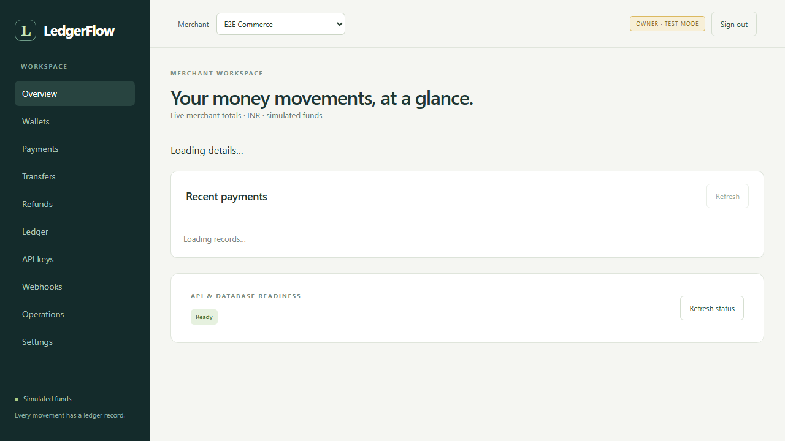
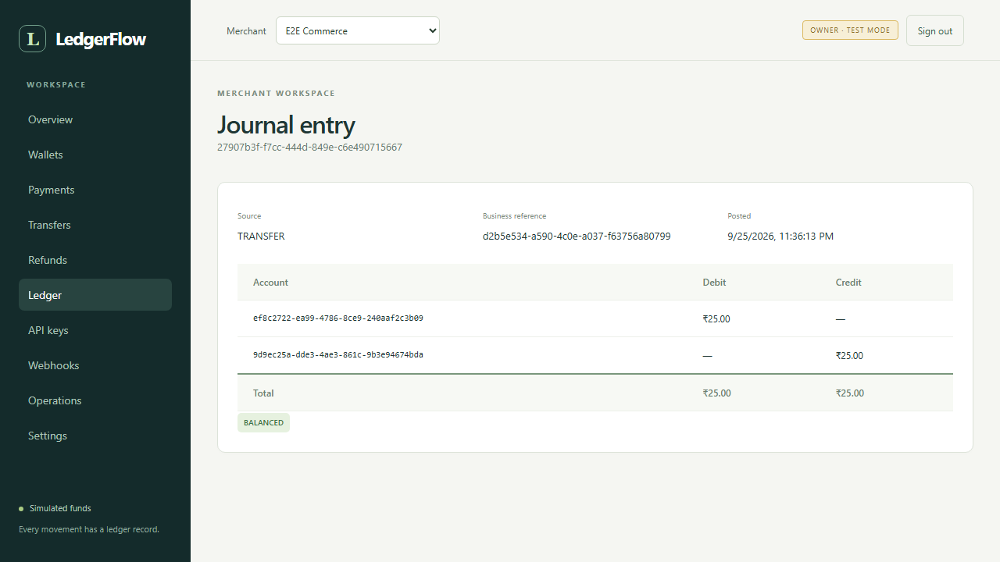
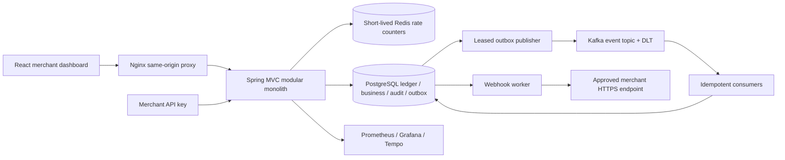

# LedgerFlow

LedgerFlow is a simulated payment, wallet and immutable double-entry ledger platform built as a Java modular monolith with a React merchant dashboard. It demonstrates PostgreSQL financial invariants, concurrent spending protection, tenant authorization, persistent idempotency, asynchronous delivery and failure recovery. No real money or payment processor is involved.

The application runs end to end through Docker Compose. Backend behavior is tested against real PostgreSQL, Kafka and Redis; a browser test exercises the packaged dashboard. This repository makes no production capacity, regulatory certification or exactly-once external-delivery claim.





Screenshots are from real local API flows. [Mobile screenshot](docs/screenshots/mobile.png).

## Implemented workflows

- Register/login, rotating refresh tokens, merchant memberships and OWNER/ADMIN/DEVELOPER/VIEWER authorization.
- Create customer/settlement wallets, simulate funding, transfer funds and inspect balances/history.
- Create/confirm/cancel payments, partial/full refunds, explicit state transitions and audit history.
- Immutable balanced journals, restricted posting functions, sorted account locks and materialized balances derived from ledger entries.
- PostgreSQL idempotency, transactional outbox, Kafka consumers with durable deduplication and dead-letter storage.
- One-time API-key secrets, encrypted webhook secrets, HMAC signing, destination validation, bounded retries, attempt history and manual replay.
- Snapshot reconciliation, dashboard operations/audit views, Redis rate limits, protected metrics and persisted trace propagation.
- Non-root images, separate migration job, optional monitoring profile, Kubernetes examples, Helm chart and CI checks.

## Run locally

Install Docker Compose v2 and Java 25. On a fresh checkout, run these from the repository root:

```sh
java scripts/GenerateLocalEnvironment.java
java scripts/GenerateDevKeys.java
java scripts/GenerateWebhookKey.java
java scripts/GenerateObservabilitySecrets.java
```

The generators create ignored random credentials and refuse to replace existing keys/configuration. Set the demo profile and event workers, then start the application:

```sh
# POSIX shell
SPRING_PROFILES_ACTIVE=demo EVENTS_ENABLED=true docker compose --profile app --profile events up --build -d --wait
```

```powershell
# PowerShell
$env:SPRING_PROFILES_ACTIVE='demo'
$env:EVENTS_ENABLED='true'
docker compose --profile app --profile events up --build -d --wait
```

Open **http://localhost:8088** and register. Create a CUSTOMER wallet, fund it with integer paise, create a SETTLEMENT wallet, then make payments/transfers. Funding is available only in the demo profile. Change POSTGRES_PORT in `.env` if port 5432 is occupied; container database traffic is unaffected. On Linux ensure mounted files are readable by the container UID/group; see [deployment instructions](docs/DEPLOYMENT.md).

For realistic demo records, with Node 24 installed:

```sh
node scripts/seed-demo.mjs
```

This creates Acme Commerce, owner/developer/viewer memberships, funded wallets, a transfer, succeeded/failed/partially-refunded/refunded payments, an API key and a passing reconciliation report. Generated credentials and one-time secrets are written only to `.local-secrets/demo-<uuid>.json`. Each run creates an independent tenant. Optional webhook seeding requires a real operator-approved URL; no fake deliveries are inserted.

`docker compose --profile app --profile events down` preserves database volumes. Adding `-v` destroys them; use it only for disposable data. The migration service must succeed before the API starts. API replicas receive restricted runtime credentials and disable Flyway.

## Architecture and financial model



Domain packages own identity, merchants, wallets, payments, ledger, refunds, outbox, notifications, webhooks, reconciliation and audit. Operations composes readmodels. ArchUnit checks cycles and internal package access. JPA is used for identity persistence; explicit JDBC/PostgreSQL functions make locking, financial posting and queue claims visible. Both share the same datasource/transaction manager. See [architecture](docs/ARCHITECTURE.md), [schema/ER model](docs/DATABASE.md) and [ADRs](docs/DECISIONS.md).

Money uses integer minor units, initially INR with exponent 2: **1000 means INR 10.00**. Individual command amounts are bounded to 9,000,000,000,000 minor units; aggregates use PostgreSQL numeric and API decimal strings. Frontend formatting uses BigInt. There is no floating-point financial arithmetic or currency conversion.

Wallet accounts represent platform liabilities: credits increase the amount owed to the wallet holder, debits decrease it. Simulated funding debits a cash-control asset and credits the wallet liability. A transfer debits the source liability and credits the destination liability. Every journal must balance; a deferred database constraint rejects unbalanced commits. Entries and journal history reject update/delete/truncate, including appending entries to an old journal. Corrections require compensating/reversal postings. The runtime role cannot directly change ledger balances or history. See [ledger semantics](docs/LEDGER.md).

A payment starts CREATED. Confirmation locks the payment, moves through PROCESSING and posts customer-to-settlement movement before SUCCEEDED; insufficient funds produce a recorded FAILED outcome. Refunds lock the payment's cumulative refund budget and post compensating settlement-to-customer entries. Partial and full refunds update explicit payment states. Payment states, ledger/projection, audit and outbox changes commit together.

## Concurrency, idempotency and events

PostgreSQL READ COMMITTED plus account locks in canonical UUID order serializes spending. The balance check happens after locking, and both sides post in one transaction. A test releases 100 concurrent INR 1,000 transfer requests against an INR 10,000 wallet: exactly ten succeed, ninety reject, the source ends at zero and all accepted journals balance. Another test submits twenty identical-key requests and verifies one transfer/stored response. These are correctness tests, not throughput benchmarks. See [transaction boundaries](docs/CONCURRENCY.md).

Idempotency keys are scoped by merchant and operation. A unique PostgreSQL insert arbitrates concurrent callers; canonical request fingerprints reject changed requests. Successful results and terminal business failures are stored in the financial transaction. Identical retries return the original status/body/Location. Response eligibility lasts 30 days; the key remains reserved afterward. Automated payload pruning is not implemented. Redis is not the idempotency store. See [idempotency](docs/IDEMPOTENCY.md).

Business transactions insert outbox events before committing. The publisher claims bounded batches using SKIP LOCKED and fenced leases, sends outside the transaction, then records publication. A crash after send can publish twice. Consumers insert a processed-event marker and their local effect in one transaction, then acknowledge the Kafka record. Aggregate keys preserve normal partition ordering; stale publisher duplicates can arrive later. There is no exactly-once external-effect claim. See [outbox](docs/OUTBOX.md), [Kafka contracts](docs/KAFKA.md) and [failure modes](docs/FAILURE-MODES.md).

Webhook HTTP requests carry timestamped HMAC signatures over exact stored bytes. Timeouts/5xx trigger bounded exponential retries with jitter, followed by an inspectable failed state and manual replay. Destinations require exact operator approval and public-address validation; the transport pins a validated address with TLS hostname checks. Merchants must deduplicate stable event IDs. Payment completion never waits for their server. [Webhook setup and verification](docs/WEBHOOKS.md).

## Security and operations

Spring Security validates asymmetric JWTs; Argon2id protects passwords and hashed refresh secrets rotate with family reuse detection. API keys have hashed high-entropy secrets, scoped access and revocation. Every financial/operational request checks tenant membership or fixed API-key scope. Frontend tokens stay in memory. Separate runtime/migration roles and immutable audit records limit application privileges. [Security assumptions and limits](docs/SECURITY.md).

Redis atomically limits socket IPs and verified principals; failure returns 503 before API work. Health checks remain independent to avoid restart storms. Behind a shared proxy, IP limits are intentionally coarse until a trusted edge policy is configured. [Redis behavior](docs/REDIS.md).

Reconciliation scans a consistent REPEATABLE READ snapshot and persists imbalances, projection mismatches, missing/orphan/duplicate postings and refund discrepancies. It never repairs history automatically. Full scans are bounded and need an incremental design for very large histories. [Reconciliation](docs/RECONCILIATION.md).

Optional `--profile observability` starts Prometheus, Grafana and Tempo. Protected metrics include HTTP/JVM/Hikari, commit-only events, webhook results and backlog/reconciliation gauges. ECS logs carry request IDs; trace context is persisted across outbox and webhook jobs. Live Prometheus scraping and exported HTTP/ledger/outbox spans have been checked locally. A complete exported merchant-webhook trace has not been inspected. [Observability setup and limits](docs/OBSERVABILITY.md).

## Versions and compatibility

The backend BOM and npm peer resolution were checked against official releases on 2026-09-25/26, then exercised by local builds/integration tests. Exact resolved dependencies live in `backend/gradle.lockfile` and `frontend/package-lock.json`.
| Component | Selection |
| --- | --- |
| Java | 25 LTS; container Temurin 25.0.4+7; local installation 25.0.1 |
| Gradle Kotlin DSL | 9.8.0 |
| Spring Boot | 4.1.1 |
| Spring Framework / Security | 7.0.9 / 7.1.1 (Boot BOM) |
| Spring Data BOM | 2026.0.1 (Boot BOM) |
| Spring Kafka / Kafka client | 4.1.1 / 4.2.1 (Boot BOM) |
| Hibernate ORM / Validator | 7.4.5.Final / 9.1.3.Final (Boot BOM) |
| PostgreSQL JDBC / Flyway | 42.7.13 / 12.4.0 (Boot BOM) |
| Jackson | 3.1.5 (Boot BOM; use Jackson 3 packages) |
| Testcontainers / JUnit | 2.0.5 / 6.0.3 (Boot BOM) |
| Mockito | 5.23.0 (Boot BOM) |
| Micrometer / tracing bridge / OpenTelemetry | 1.17.1 / 1.7.1 / 1.62.0 (Boot BOM) |
| ArchUnit / springdoc | 1.5.0 / 3.1.1 |
| Bouncy Castle (Argon2 implementation) | 1.86 |
| PostgreSQL server | 18.6 |
| Kafka broker | 4.3.1, KRaft |
| Redis | 8.10.2 (official GitHub latest release) |
| Node | 24.21.0 LTS; >=24.15 required by jsdom; original host 24.11.1 is too old |
| React / React DOM | 19.3.0 |
| TypeScript / Vite / React plugin | 6.0.3 / 8.3.1 / 6.1.1 |
| React Router / TanStack Query | 7.18.4 / 5.103.2 |
| React Hook Form / resolvers / Zod | 7.88.0 / 5.9.1 / 4.6.5 |
| Tailwind / Recharts | 4.3.3 / 3.10.1 |
| Vitest / React Testing Library / Playwright | 5.0.1 / 16.3.3 / 1.63.0 |
| ESLint / typescript-eslint | 10.11.0 / 8.70.1 |
| Spring Data Redis / Lettuce | 4.1.1 / 7.5.2.RELEASE |
| Prometheus / Grafana / Tempo | 3.15.0 / 13.2.2 / 3.0.3 |
| Nginx / k6 / Helm validation | 1.30.5 / 2.3.0 / 4.3.0 |

[Spring Boot requirements](https://docs.spring.io/spring-boot/system-requirements.html) cover Java 25, Framework 7 and Gradle 9; [springdoc 3](https://springdoc.org/) supports Boot 4. Boot-managed versions stay aligned. TypeScript 6.0.3 is used because the installed typescript-eslint supports <6.1; npm's newer TypeScript major is not forced through incompatible peers. ArchUnit provides module enforcement; Spring Modulith/Batch were not added without a demonstrated need.

## Host development and API tools

Start `docker compose --profile events up -d --wait`, load `.env` variables into the shell, and run:

```sh
cd backend
./gradlew bootRun
# Separate terminal, Node 24:
cd frontend
npm ci
npm run dev
```

Windows can use `scripts/StartBackend.ps1 -JavaHome 'path-to-java-25'`; it loads documented local configuration/key files. For PostgreSQL-only trusted development explicitly set RATE_LIMIT_ENABLED=false. Normal development uses Redis. Frontend Vite proxies the API at localhost:8080. Set SPRING_PROFILES_ACTIVE=demo for simulated funding and EVENTS_ENABLED=true for workers.

Set API_DOCS_ENABLED=true locally for **http://localhost:8080/swagger-ui/index.html** and `/v3/api-docs` (disabled by default). Some replayed JSON responses have generic generated schemas; [API semantics](docs/API.md) and [curl/executable examples](docs/API-EXAMPLES.md) describe the full contract.

## Verification

```sh
cd backend
./gradlew build          # strict compiler, unit/architecture and real-container integration tests
cd ../frontend
npm ci
npm run lint
npm run typecheck
npm test
npm run build
# With the packaged demo API running:
E2E_BASE_URL=http://127.0.0.1:8088 npm run test:e2e
```

Docker is mandatory for backend integration tests; no H2 substitution or silent skipping. Tests cover direct forbidden SQL, malformed journals, concurrent spending, duplicate requests/events, refund limits, tenant scopes, real Kafka outage/retry/DLT, real webhook 500/timeout/HMAC, reconciliation corruption detection, Redis outage/rate counters and trace propagation. Chromium uses real endpoints without intercepting financial responses. CI runs backend/frontend checks plus a clean-volume packaged browser job; remote CI execution is not yet observed.

On Windows, set JAVA_HOME to an installed Java 25, use the Docker Desktop Linux engine, and remove malformed quoted PATH entries if Testcontainers discovery fails. DOCKER_HOST may need `npipe:////./pipe/dockerDesktopLinuxEngine`. [Phase-by-phase evidence](docs/IMPLEMENTATION.md).

k6 scripts measure balance/history, transfer and payment flows with p50/p95/p99 and error rates. The short local smoke run validates the workload only; no capacity benchmark is claimed. Actual SQL plans are saved with small-fixture limitations. [Performance instructions](docs/PERFORMANCE.md).

## Deployment, tradeoffs and remaining work

[Deployment instructions](docs/DEPLOYMENT.md) cover Docker, separate migrations, existing Kubernetes Secrets, probes, HPA, TLS Ingress and managed-data prerequisites. Helm lint/template passed; no cluster rollout is claimed. [Scaling discussion](docs/SCALING.md) evaluates 10 through 100,000+ requests/s as hypotheses, including hot-account locks, connection budgets, partitioning, archival and service extraction. [Interview guide](docs/INTERVIEW-GUIDE.md) explains the implemented tradeoffs; [resume bullets](docs/RESUME.md) avoid invented production results.

Known limits: INR-only merchant-owned simulated wallets; no cross-tenant transfers/FX/processor integration; no MFA/reset/email verification or overlapping signing/encryption-key rotation; no OIDC provider; no automated DLT/blocked-outbox replay or retention jobs; full-scan reconciliation; API-key lists capped at 100 and some small configuration lists unpaginated; no production backup/restore exercise, cluster rollout, broker-lag exporter, Loki pipeline, alert delivery routing or full backend vulnerability scan. These are disclosed boundaries, not inactive UI controls.

The roadmap prioritizes key rotation and identity recovery, reviewed operational replay/retention, managed-provider restore/failover exercises, large-fixture query/load analysis and incremental reconciliation. Extract webhook workers when independent scaling justifies it; do not split ledger/payment transactions into services without a specified consistency protocol.
