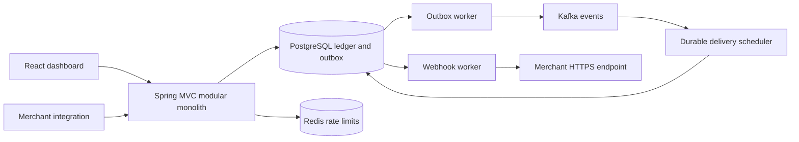

# LedgerFlow

A simulated payment, wallet, and double-entry ledger platform being developed as a modular Java application. No real money, bank integration, or payment credentials are involved.

**Status: Phase 0 architecture design. No application functionality is implemented yet.** Documents describe intended behavior, not verified capabilities. See [implementation status](docs/IMPLEMENTATION.md) for phase gates and evidence.

## Engineering focus

The design prioritizes balanced immutable postings, PostgreSQL transaction atomicity, concurrent spending protection, tenant isolation, persistent idempotency, and recovery from duplicate messages. A React merchant dashboard will expose the same authenticated APIs as integrations.

## Proposed exact version matrix

Verified against official release documentation, Maven Central metadata/BOM, and npm `latest` metadata on 2026-09-25. Registry resolution and execution tests are separate compatibility gates; the matrix is not a claim that the application has built.

| Component | Selection |
| --- | --- |
| Java | 25 LTS; target Temurin 25.0.4+101 (Adoptium release API); local installation 25.0.1 |
| Gradle Kotlin DSL | 9.8.0 |
| Spring Boot | 4.1.1 |
| Spring Framework / Security | 7.0.9 / 7.1.1 (Boot BOM) |
| Spring Data BOM | 2026.0.1 (Boot BOM) |
| Spring Kafka / Kafka client | 4.1.1 / 4.2.1 (Boot BOM) |
| Hibernate ORM / Validator | 7.4.5.Final / 9.1.3.Final (Boot BOM) |
| PostgreSQL JDBC / Flyway | 42.7.13 / 12.4.0 (Boot BOM) |
| Jackson | 3.1.5 (Boot BOM; use Jackson 3 packages) |
| Testcontainers / JUnit | 2.0.5 / 6.0.3 (Boot BOM) |
| Mockito | 5.23.0 (Boot BOM) |
| Micrometer / tracing bridge / OpenTelemetry | 1.17.1 / 1.7.1 / 1.62.0 (Boot BOM) |
| Spring Modulith | 2.1.1, verification only initially |
| ArchUnit / springdoc | 1.5.0 / 3.1.1 |
| PostgreSQL server | 18.6 |
| Kafka broker | 4.3.1, KRaft |
| Redis | 8.10.2 (official GitHub latest release) |
| Node | 24 LTS; local installation 24.11.1 |
| React / React DOM | 19.3.0 |
| TypeScript / Vite / React plugin | 7.0.2 / 8.3.1 / 6.1.1 |
| React Router / TanStack Query | 7.18.4 / 5.103.2 |
| React Hook Form / resolvers / Zod | 7.88.0 / 5.9.1 / 4.6.5 |
| Tailwind / Recharts | 4.3.3 / 3.10.1 |
| Vitest / React Testing Library / Playwright | 5.0.1 / 16.3.3 / 1.63.0 |
| ESLint / typescript-eslint | 10.11.0 / 8.70.1 |

Boot supports Java 25; Gradle can run on Java 25 from 9.1 onward. Keep Boot-managed libraries aligned rather than independently selecting their newest versions. The newer broker/older client combination needs a real Kafka container test. npm peer dependency resolution and frontend builds must validate the frontend combination. Observability images will be selected when that phase is implemented.

Sources: [Boot requirements](https://docs.spring.io/spring-boot/system-requirements.html), [Boot BOM](https://repo.maven.apache.org/maven2/org/springframework/boot/spring-boot-dependencies/4.1.1/spring-boot-dependencies-4.1.1.pom), [Gradle compatibility](https://docs.gradle.org/current/userguide/compatibility.html), [PostgreSQL releases](https://www.postgresql.org/support/versioning/), [Kafka releases](https://kafka.apache.org/community/downloads/), [Redis releases](https://redis.io/docs/latest/operate/oss_and_stack/stack-with-enterprise/release-notes/redisce/), [npm registry](https://registry.npmjs.org/).

## Design and implementation references

- [Architecture and complexity review](docs/ARCHITECTURE.md)
- [Database and ER model](docs/DATABASE.md)
- [Ledger accounting](docs/LEDGER.md)
- [Concurrency and transaction boundaries](docs/CONCURRENCY.md)
- [Idempotency](docs/IDEMPOTENCY.md)
- [Outbox](docs/OUTBOX.md) and [Kafka contracts](docs/KAFKA.md)
- [API contract](docs/API.md)
- [Security](docs/SECURITY.md) and [failure modes](docs/FAILURE-MODES.md)
- [Observability](docs/OBSERVABILITY.md) and [scaling](docs/SCALING.md)
- [Decisions](docs/DECISIONS.md) and [implementation roadmap](docs/IMPLEMENTATION.md)

## Current limitations

The repository does not yet have runnable backend/frontend code, migrations, deployment manifests, seed data, screenshots, or benchmark results. Setup instructions, tested API examples, interview explanations, and resume bullets will be added as their underlying functionality is verified. Do not interpret the architecture documents as implementation claims.
