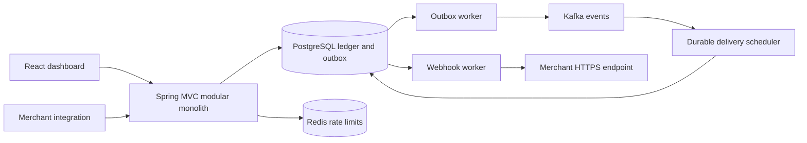

# LedgerFlow

A simulated payment, wallet, and double-entry ledger platform being developed as a modular Java application. No real money, bank integration, or payment credentials are involved.

**Status: identity, immutable ledger, wallets, transfers, idempotent payments/refunds and merchant API keys are implemented and tested. Kafka outbox delivery, persistent consumer deduplication, notifications and dead-letter storage are implemented.** The React shell displays live readiness. See [implementation status](docs/IMPLEMENTATION.md) for phase gates and evidence; design documents describe the target behavior.

## Engineering focus

The design prioritizes balanced immutable postings, PostgreSQL transaction atomicity, concurrent spending protection, tenant isolation, persistent idempotency, and recovery from duplicate messages. A React merchant dashboard will expose the same authenticated APIs as integrations.



## Proposed exact version matrix

Verified against official release documentation, Maven Central metadata/BOM, and npm `latest` metadata on 2026-09-25. Registry resolution and execution tests are separate compatibility gates; the matrix is not a claim that the application has built.

| Component | Selection |
| --- | --- |
| Java | 25 LTS; target Temurin 25.0.4+101 (Adoptium release API); local installation 25.0.1 |
| Gradle Kotlin DSL | 9.8.0 |
| Spring Boot | 4.1.1 |
| Spring Framework / Security | 7.0.9 / 7.1.1 (Boot BOM) |
| Spring Data BOM | 2026.0.1 (Boot BOM) |
| Spring Kafka / Kafka client | 4.1.1 / 4.2.1 (Boot BOM) |
| Hibernate ORM / Validator | 7.4.5.Final / 9.1.3.Final (Boot BOM) |
| PostgreSQL JDBC / Flyway | 42.7.13 / 12.4.0 (Boot BOM) |
| Jackson | 3.1.5 (Boot BOM; use Jackson 3 packages) |
| Testcontainers / JUnit | 2.0.5 / 6.0.3 (Boot BOM) |
| Mockito | 5.23.0 (Boot BOM) |
| Micrometer / tracing bridge / OpenTelemetry | 1.17.1 / 1.7.1 / 1.62.0 (Boot BOM) |
| Spring Modulith | 2.1.1, verification only initially |
| ArchUnit / springdoc | 1.5.0 / 3.1.1 |
| Bouncy Castle (Argon2 implementation) | 1.86 |
| PostgreSQL server | 18.6 |
| Kafka broker | 4.3.1, KRaft |
| Redis | 8.10.2 (official GitHub latest release) |
| Node | 24.21.0 LTS; >=24.15 required by jsdom; original host 24.11.1 is too old |
| React / React DOM | 19.3.0 |
| TypeScript / Vite / React plugin | 6.0.3 / 8.3.1 / 6.1.1 |
| React Router / TanStack Query | 7.18.4 / 5.103.2 |
| React Hook Form / resolvers / Zod | 7.88.0 / 5.9.1 / 4.6.5 |
| Tailwind / Recharts | 4.3.3 / 3.10.1 |
| Vitest / React Testing Library / Playwright | 5.0.1 / 16.3.3 / 1.63.0 |
| ESLint / typescript-eslint | 10.11.0 / 8.70.1 |

Boot supports Java 25; Gradle can run on Java 25 from 9.1 onward. Keep Boot-managed libraries aligned rather than independently selecting their newest versions. The newer broker/older client combination needs a real Kafka container test. npm peer dependency resolution and frontend builds must validate the frontend combination. Observability images will be selected when that phase is implemented.

Compatibility correction during Phase 1: npm's latest TypeScript 7.0.2 is outside typescript-eslint 8.70.1's supported `>=4.8.4 <6.1.0` peer range. Use the current compatible TypeScript 6.0.3 release; do not bypass peer checks with `--force` or `--legacy-peer-deps`.

Sources: [Boot requirements](https://docs.spring.io/spring-boot/system-requirements.html), [Boot BOM](https://repo.maven.apache.org/maven2/org/springframework/boot/spring-boot-dependencies/4.1.1/spring-boot-dependencies-4.1.1.pom), [Gradle compatibility](https://docs.gradle.org/current/userguide/compatibility.html), [PostgreSQL releases](https://www.postgresql.org/support/versioning/), [Kafka releases](https://kafka.apache.org/community/downloads/), [Redis releases](https://redis.io/docs/latest/operate/oss_and_stack/stack-with-enterprise/release-notes/redisce/), [npm registry](https://registry.npmjs.org/).

## Design and implementation references

- [Architecture and complexity review](docs/ARCHITECTURE.md)
- [Database and ER model](docs/DATABASE.md)
- [Ledger accounting](docs/LEDGER.md)
- [Concurrency and transaction boundaries](docs/CONCURRENCY.md)
- [Idempotency](docs/IDEMPOTENCY.md)
- [Outbox](docs/OUTBOX.md) and [Kafka contracts](docs/KAFKA.md)
- [API contract](docs/API.md)
- [Security](docs/SECURITY.md) and [failure modes](docs/FAILURE-MODES.md)
- [Observability](docs/OBSERVABILITY.md) and [scaling](docs/SCALING.md)
- [Decisions](docs/DECISIONS.md) and [implementation roadmap](docs/IMPLEMENTATION.md)

## Local development

Prerequisites: Java 25 with valid JAVA_HOME, Node 24.21.0, Docker Compose with Linux containers. Copy `.env.example` to `.env`. Choose separate migration/runtime passwords: POSTGRES_PASSWORD must match DB_MIGRATION_PASSWORD, and APP_DB_PASSWORD must match DB_PASSWORD. Runtime connects as restricted ledgerflow_app; Flyway uses ledgerflow_migrator. Compose bootstraps roles on a fresh volume. An existing database needs these roles provisioned explicitly; never delete financial data just to rerun initialization.

```bash
cp .env.example .env
# Edit .env before starting. Do not commit it.
docker compose up -d --wait postgres
java scripts/GenerateDevKeys.java
cd backend
# Export DB_PASSWORD and DB_MIGRATION_PASSWORD to match .env.
./gradlew bootRun
```

Flyway runs on startup; there is no separate `flywayMigrate` Gradle task. `bootRun` and tests use UTC. For a direct jar run use `java -Duser.timezone=UTC -jar build/libs/ledgerflow-0.1.0-SNAPSHOT.jar` and supply both DB passwords. On PowerShell, `scripts/StartBackend.ps1 -JavaHome 'C:\Program Files\Java\jdk-25'` loads recognized backend variables from `.env`; it never evaluates the file as code. Direct Gradle/JVM runs do not load `.env` automatically. If port 5432 is occupied, set POSTGRES_PORT (for example 55432) and update DB_URL accordingly.

In a second terminal:

```bash
cd frontend
npm ci
npm run dev
```

Open http://localhost:5173. Vite proxies API and readiness calls to localhost:8080. Authentication is available through the API; the dashboard login screens arrive in Phase 10. Optional event infrastructure: `docker compose --profile events up -d --wait`. The Kafka/Redis configurations have been syntax-checked; event integration arrives in later phases.

Register with `POST /api/v1/auth/register` and JSON `{"email":"owner@example.test","password":"choose-a-long-local-password","merchantName":"Acme Commerce"}`. Login at `/api/v1/auth/login` with email/password. Use the returned accessToken as a Bearer token and registration's merchantId as `X-Merchant-Id` on `/api/v1/merchant`. Refresh/logout accept `{"refreshToken":"<returned-token>"}`. Secrets are never printed by the development key generator or stored in the repository. Keep this local until the planned rate limiting and deployment controls are installed.

## Verification

To enable simulated funding, set `SPRING_PROFILES_ACTIVE=demo` when starting the backend. Create wallets through `POST /api/v1/wallets` with label, kind (`CUSTOMER` or `SETTLEMENT`) and currency (`INR`). Fund via `POST /api/v1/wallets/{id}/funding`, then transfer through `/api/v1/transfers`. Both money endpoints require Idempotency-Key and integer minor-unit amount/currency. `1000` means INR 10.00. Read balances at `/wallets/{id}/balance`, history at `/wallets/{id}/transactions`, and journal entries at `/ledger/transactions/{id}`. No Kafka publishing is claimed yet; event intent is stored transactionally.

```bash
cd backend
./gradlew build                 # compile, architecture test, real PostgreSQL tests, jar
cd ../frontend
npm run lint
npm run typecheck
npm test
npm run build
cd ..
docker compose --env-file .env.example --profile events config --quiet
```

Docker must be available for backend integration tests; they do not silently skip without it. Testcontainers creates disposable PostgreSQL databases, independent of the Compose database. The initial suite verifies clean migrations, readiness, request IDs and denied private routes. Dependency versions are locked in `backend/gradle.lockfile` and `frontend/package-lock.json`; the Gradle wrapper verifies its distribution checksum. CI runs these checks on Linux; local Windows execution is recorded, CI execution is not yet observed.

If Windows Testcontainers fails while scanning PATH, remove malformed quoted PATH entries in the launching shell. If JAVA_HOME points to a removed JDK, point it to Java 25. For Docker Desktop use the Linux engine; DOCKER_HOST may need `npipe:////./pipe/dockerDesktopLinuxEngine`. No application test uses H2.

## Current limitations

Financial modules, event workers, credential rate limiting, dashboard forms, deployment images/manifests, seed data, screenshots and benchmark results remain unimplemented. Authentication has no MFA, email verification, password recovery or overlapping signing-key rotation. Interview explanations and resume bullets will be added only as their underlying functionality is verified. The shell intentionally contains no mock payment statistics or inactive feature controls. Do not interpret the architecture documents as implementation claims.
