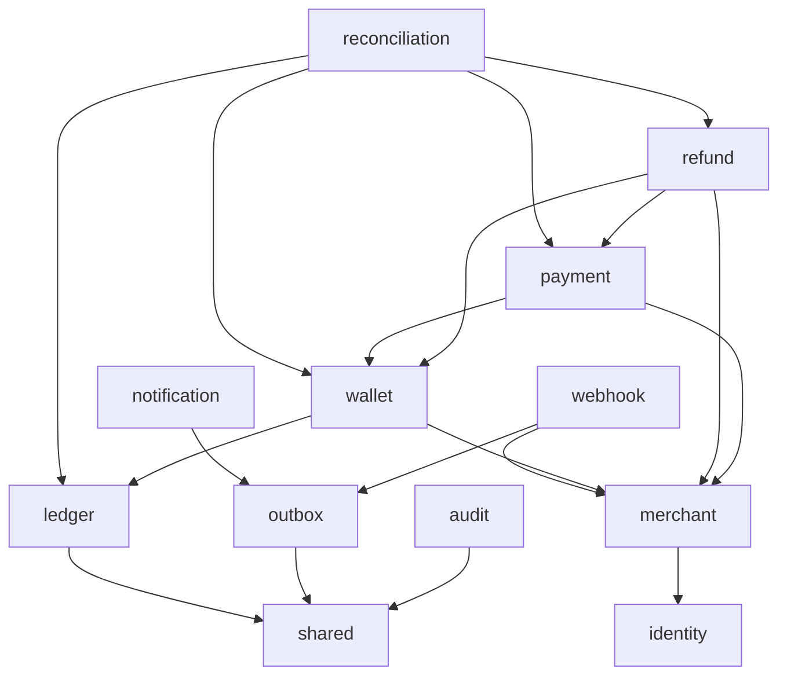

# Architecture

Status: accepted Phase 0 design; implementation evidence lives in IMPLEMENTATION.md.

## Scope and assumptions

LedgerFlow simulates merchant-controlled customer wallets and settlement wallets. Every financial account belongs to exactly one merchant and currency. Initially support INR with exponent 2: API amount 1000 means INR 10.00. There is no FX, external settlement, credit, chargeback, interest, real customer debit authorization, or cross-merchant transfer. A merchant API key controls wallets in its own simulation sandbox; it is not authorization to debit real customer funds.

Use one Spring MVC deployment and one PostgreSQL database. Logical modules own tables, domain objects, application services, and controllers. JPA handles normal aggregates; explicit JDBC/native SQL handles lock acquisition, posting, queue claiming, and reports where SQL makes correctness visible. All use the same datasource and transaction manager. Disable open-session-in-view and Hibernate DDL mutation.

## Module dependency graph



Business application services may append audit and outbox records via their public APIs and use shared idempotency infrastructure. Those modules must not call business services back. Kafka deserialization uses shared event DTOs rather than business entities. Reconciliation invokes explicit read ports or reporting SQL; it never reaches into a module's repository. Authentication depends on identity's credential interfaces, not merchant implementation internals; merchant services perform membership authorization using authenticated subject IDs.

Each module has a small public root API and `internal` packages for domain, persistence, and HTTP adapters. ArchUnit prohibits references to another module's internals; Modulith checks cycles. No global controller/service/repository packages. `shared` holds Money, IDs/context, problem types, idempotency infrastructure, and event envelopes only. It must not become a generic business service layer.

| Owner | Responsibilities and owned records |
| --- | --- |
| identity | User, password hash, refresh session, access token issuance/validation integration |
| merchant | Merchant, MerchantMembership, APIKey, role decisions |
| ledger | LedgerAccount, LedgerTransaction, LedgerEntry, authoritative posting and balance projection |
| wallet | Wallet, Transfer, funding orchestration; refers to accounts by ID |
| payment | Payment lifecycle, settlement wallet routing, immutable transition history |
| refund | Refund, payment-level refund serialization through payment public API |
| outbox | OutboxEvent publisher; ProcessedEvent utility used in consumer transactions |
| webhook | WebhookEndpoint, WebhookDelivery, WebhookAttempt, replay/retry |
| notification | Persisted dashboard notification projection, no email delivery initially |
| reconciliation | ReconciliationRun and discrepancy records |
| audit | Append-only AuditEvent |
| shared | Small infrastructure/value-type kernel, IdempotencyRecord |

## Payment flow

Create a payment in CREATED with a customer wallet and merchant settlement wallet. Creation reserves no funds. Confirm transitions CREATED to PROCESSING and then SUCCEEDED/FAILED in one database transaction; PROCESSING is visible in transition history, not a durable asynchronous promise. Insufficient funds produces persisted FAILED, no posting. Cancellation is allowed only from CREATED. Confirm must be a separate explicit endpoint so integrations can inspect/cancel created payments.

```mermaid
sequenceDiagram
  participant C as Client
  participant P as Payment application service
  participant DB as PostgreSQL
  participant O as Outbox worker
  participant K as Kafka
  C->>P: Confirm + Idempotency-Key
  P->>DB: BEGIN; claim request; lock payment and accounts
  P->>DB: Validate; posting; balances; transitions; audit; outbox; response
  P->>DB: COMMIT (deferred ledger constraints)
  P-->>C: Stored response
  O->>DB: Claim eligible event with lease
  O->>K: Publish event with stable event ID
  K-->>O: Broker acknowledgement
  O->>DB: Mark published with lease token
```

## Complexity review

Keep Kafka because webhook/notification projections require replayable asynchronous fan-out. Financial posting never depends on Kafka availability. Use one topic for versioned business events, plus DLT; do not create a topic per event type. Use a polling outbox first; Debezium adds operational cost without evidence of throughput need. Use database-backed scheduled reconciliation, not Spring Batch until checkpointed partition processing is needed. Use ArchUnit/Modulith verification without the Modulith event publication registry, avoiding two competing outboxes. No Redis financial locks, saga framework, service mesh, Elasticsearch, or separate microservices.

First-party auth avoids a mandatory local identity server. Spring Security's JWT resource server performs token validation; credential issuance and refresh rotation remain explicit application responsibilities. OIDC can replace identity authentication later without changing tenant authorization.

## Architectural risks to test before acceptance

1. Deferred balance validation must reject empty transactions and appends to old transactions, not only an unequal pair of entries.
2. A ledger-derived projection must be changed only by the posting path; otherwise nonnegative balances alone do not prevent corruption.
3. Payment/refund/account lock order must be consistent across all command paths.
4. Lease expiry creates duplicate sends; tokens protect queue state but cannot make an HTTP receiver exactly-once.
5. Kafka keys alone do not preserve database order across concurrent publishers. Publisher eligibility must serialize each aggregate's stream.
6. Reconciliation needs a consistent snapshot, or live writes cause false discrepancies.
7. SSRF protection requires destination enforcement at connection time and production egress policy, not only URL validation at registration.
