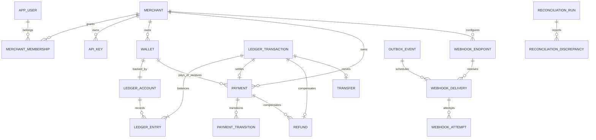

# PostgreSQL schema design

Status: logical schema accepted in Phase 0; Flyway DDL and execution plans are not yet implemented or measured. All IDs are UUIDv4 generated by the application (portable, no node coordination; less index locality than UUIDv7). Times use timestamptz/UTC. Version counters are bigint. Financial amounts are bigint with numeric aggregation. Money never uses floating point.

## Relations and constraints

Every tenant table includes `merchant_id NOT NULL`. Where two tenant tables reference one another, use a unique parent `(merchant_id,id)` and composite child FK, not only a UUID FK. Account/entry FKs also include currency. FK deletion is RESTRICT for financial records; deactivate rather than cascade-delete. JSONB is bounded by application validation and SQL size checks for metadata/payloads. Do not put unbounded arrays of attempts or entries into JSONB.

| Table | Principal fields / constraints |
| --- | --- |
| currency | code PK, exponent 0..3, enabled; initially INR/2 only |
| app_user | id PK, normalized_email UNIQUE, password_hash, enabled, created_at; no password returned |
| refresh_session | id, user_id FK, token_hash UNIQUE, family_id, expires_at, consumed_at, revoked_at; rotation/reuse detection |
| merchant | id, display_name, status, created_at |
| merchant_membership | merchant_id + user_id PK/FKs, role CHECK OWNER/ADMIN/DEVELOPER/VIEWER; serialize owner removal on merchant row to prevent last-owner race |
| api_key | id, merchant_id, prefix UNIQUE, secret_hash, name, scopes, created_at, last_used_at, revoked_at; no recoverable secret |
| ledger_account | id, merchant_id, currency FK, kind ASSET/LIABILITY, purpose CASH_CONTROL/WALLET, balance_minor >=0, version, active; one control account per tenant/currency via partial UNIQUE |
| wallet | id, merchant_id, account_id UNIQUE with tenant FK, label, kind CUSTOMER/SETTLEMENT, external_customer_id nullable, created_at; partial UNIQUE merchant/customer/currency mapping; one settlement wallet per merchant/currency |
| ledger_transaction | id, merchant_id, currency, business_type, business_id, reverses_transaction_id nullable UNIQUE/FK, posted_at, server-only creation_xid; UNIQUE merchant/business_type/business_id; append-only |
| ledger_entry | id, merchant_id, transaction_id, account_id, currency, side DEBIT/CREDIT, amount_minor >0, ordinal; UNIQUE transaction/ordinal; composite FKs; append-only |
| funding | id, merchant_id, wallet_id, amount_minor, currency, ledger_transaction_id UNIQUE, created_at; demo-only command |
| transfer | id, merchant_id, source_wallet_id, destination_wallet_id, amount_minor, currency, ledger_transaction_id UNIQUE, created_at; source != destination; only completed transfers persisted |
| payment | id, merchant_id, customer_wallet_id, settlement_wallet_id, amount_minor >0, currency, reference, metadata, status, refunded_minor between 0 and amount, ledger_transaction_id nullable UNIQUE, version, created_at/updated_at; successful/refund statuses require ledger FK |
| payment_transition | id, merchant_id, payment_id, from_state nullable, to_state, aggregate_version, occurred_at, reason_code; append-only |
| refund | id, merchant_id, payment_id, amount_minor >0, currency, status SUCCEEDED/FAILED, failure_code nullable, ledger_transaction_id nullable UNIQUE, created_at; success requires ledger FK |
| idempotency_record | merchant_id + operation + key PK, fingerprint/version, status_code, response_json nullable, resource_type/id, location, created_at, response_expires_at; response eviction retains key tombstone |
| outbox_event | id, merchant_id, aggregate_type/id/version/event_index UNIQUE, event_type, payload, trace_context, created_at, state, attempts, next_attempt_at, lease_token/until, published_at, last_error_code |
| processed_event | consumer_name + event_id PK, processed_at; persistent duplicate suppression |
| webhook_endpoint | id, merchant_id, url, enabled, secret_ciphertext, encryption_key_version, created_at/updated_at; secret shown once |
| webhook_subscription | endpoint_id + event_type PK, merchant_id FK |
| webhook_delivery | id, merchant_id, endpoint_id, event_id, payload_snapshot, destination_snapshot, secret_version, status, attempts, next_attempt_at, lease_token/until, last_status, last_error, replay_generation; UNIQUE endpoint/event_id |
| webhook_attempt | id, merchant_id, delivery_id, attempt_number, started_at/completed_at, HTTP status, bounded sanitized snippet, duration_ms, error_code; UNIQUE delivery/attempt; append-only |
| notification | id, merchant_id, event_id, kind, text, created_at, read_at; UNIQUE merchant/event/kind |
| reconciliation_run | id, merchant_id, status, started_at/completed_at, records_processed, discrepancy_count, duration_ms, snapshot_at, failure_code |
| reconciliation_discrepancy | id, merchant_id, run_id, kind, resource_id, expected/actual numeric or bounded JSON, detected_at |
| audit_event | id, merchant_id nullable for authentication, actor_type/id, action, resource_type/id, safe_metadata, correlation_id, occurred_at; append-only |

Payment-state transition checks belong in the domain and a database transition guard. Amount, tenant, currency, wallet references and original ledger reference become immutable after creation/settlement as appropriate. Deferred consistency checks validate success/refund links and cumulative successful refunds. Cross-row sums cannot be ordinary CHECK constraints: use deferred constraint triggers and serialize on the payment row. Refund failure does not increment refunded_minor.

## Indexes and access paths

Tenant list indexes lead with merchant_id: `(merchant_id,created_at DESC,id DESC)` on payments/transfers/refunds/audit/journals, plus `(merchant_id,status,created_at DESC,id DESC)` for payment filters. Exact merchant reference search uses `(merchant_id,reference)`; do not add costly wildcard indexes before profiling. Wallet history uses `(account_id,transaction_id,id)` plus journal ordering; test plan before adding a denormalized posting timestamp. Entry reconciliation groups `(merchant_id,account_id)` and `(merchant_id,transaction_id)`.

Outbox partial index `(next_attempt_at,created_at,id) WHERE published_at IS NULL`, plus aggregate sequence index. Webhook due index `(next_attempt_at,id) WHERE status IN ('PENDING','RETRY')`, lease-expiry index for IN_FLIGHT. Index FK columns used in joins/deletion checks. Keep append-only index count small enough to avoid unnecessary write amplification.

## Reconciliation snapshot

Create RUNNING row in a short transaction. In a REPEATABLE READ read transaction, compute journal totals, account projection differences, missing/mismatched business links, duplicate business references, orphans, refund sums, and tenant/currency agreement. Persist findings plus completion as a separate short transaction with snapshot timestamp. Crashed RUNNING jobs become ABORTED via lease expiry and can be rerun. Findings describe the snapshot, not necessarily the current row. Never auto-edit history. Use one active run per merchant enforced by partial uniqueness/lease ownership.

## SQL analysis plan

Run EXPLAIN (ANALYZE, BUFFERS) only against seeded disposable data; ANALYZE executes the query. Record server version, row counts, indexes, cache state, plan, and timing. No execution-plan results have been generated yet. Required queries: payment keyset page, account-history running sum, daily success/refund rate, outbox claim, and reconciliation aggregation. SQL examples and actual plans are a Phase 13 deliverable; do not label hypothetical plans measured.

Schema migrations use a dedicated owner; runtime uses restricted grants. Deployment migration is a serialized job before new pods start, not schema mutation by Hibernate. Local Flyway may share a development owner only if the runtime privilege tests also run with a restricted role.
