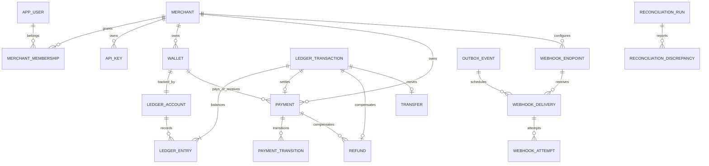

# PostgreSQL design

Flyway V1–V10 are the schema source of truth. Hibernate validates and never creates or updates production tables. Application identifiers use UUIDv4 (ledger-entry UUIDs are generated by PostgreSQL); this avoids node coordination at the cost of poorer index locality than UUIDv7. Times use timestamptz/UTC, individual amounts bigint, and aggregate arithmetic numeric. Every financial relation carries merchant and currency constraints.

## Ownership and invariants

Identity owns app_user/refresh_session; merchant owns merchant/membership/api_key; wallet owns wallet/funding/transfer; payment owns payment/transition; refund owns refund. The ledger owns ledger_account, ledger_transaction and ledger_entry, including the account balance projection. Outbox/processed_event, notification/dead_letter, webhook endpoint/delivery/attempt, reconciliation run/discrepancy and audit_event persist asynchronous and operational state. Readmodels in operations do not own financial writes.

Composite foreign keys enforce tenant/currency agreement between accounts, journals, entries and business records. Unique business references prevent duplicate postings. The deferred journal constraint requires at least two entries and balanced debit/credit totals at commit. Historical rows reject UPDATE/DELETE/TRUNCATE; entries can only be inserted into a journal in its creating transaction. The posting function owns sorted account locks, balance validation and projection changes. The runtime role has EXECUTE but cannot directly edit ledger balances or history. SECURITY DEFINER functions have an explicit safe search path and a separate NOLOGIN owner.

The standalone migration job uses a separate identity, as documented in DEPLOYMENT.md. Local host bootRun may migrate with configured migration credentials, while Compose/Kubernetes API replicas disable Flyway and use restricted runtime credentials. Runtime-role integration tests attempt forbidden writes and malformed postings.

## Indexes and access patterns

Payment/transfer/refund/wallet lists use tenant-leading created_at/id indexes and keyset pagination. Payment status filtering uses (merchant_id,status,created_at DESC,id DESC); exact reference uses (merchant_id,reference). Journal lists use (merchant_id,posted_at DESC,id DESC), entries use (merchant_id,account_id,transaction_id). There is no wildcard search or arbitrary sorting. A unique partial index permits one settlement wallet per tenant/currency and one active reconciliation run per tenant.

The outbox due partial index covers unpublished rows, and aggregate/version uniqueness prevents duplicated logical transitions. Claims use FOR UPDATE SKIP LOCKED, leases and fencing. Durable consumer markers are unique per consumer/event; webhook delivery is unique per endpoint/event. Idempotency is unique per tenant/operation/key. PostgreSQL waits on competing uncommitted inserts before resolving conflicts. These are correctness constraints, not Redis locks.

## Transaction boundaries

Financial commands atomically commit their idempotency record, business outcome, ledger journal/projection, audit and outbox events. Payment/refund locks precede sorted account locks. Broker and merchant HTTP I/O occur outside financial transactions. Publisher/worker claim and completion are short separate transactions, accepting duplicate external effects after a crash.

Reconciliation first creates a pending run. The worker claims a lease, then checks all invariants and persists findings/completion in one REPEATABLE READ transaction with a bounded SQL timeout. It locks the run, not account rows. Crashed leases are reclaimed; repeated abandoned runs fail after the configured recovery budget. There is no ABORTED state or separate inconsistent findings snapshot. See RECONCILIATION.md for details.

## Measured SQL

scripts/query-analysis.sql contains tenant pagination, filtered reads, CTE aggregation, joins and a windowed running balance. Actual EXPLAIN (ANALYZE, BUFFERS) output is in measurements/query-plans.txt; PERFORMANCE.md explains the small fixture and warm-cache limitations. Those results do not justify new indexes at production scale. Analyze retained volume/tenant skew before tuning. PostgreSQL MVCC, WAL, autovacuum, backup restore, retention and connection budgets remain deployment responsibilities.
