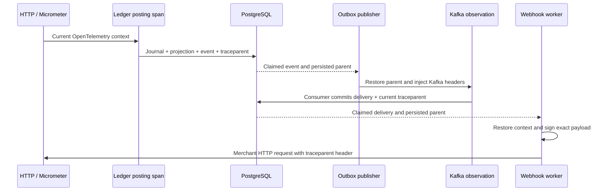

# Observability

LedgerFlow exposes measured HTTP/JVM/Hikari metrics, commit-only domain-event counters, application span timers, webhook result counters/latency, and database-backed backlog gauges. No merchant, account, payment or request identifiers are metric labels. The Grafana dashboard is provisioned from `infra/grafana/dashboards/operations.json`; panel data comes from Prometheus, never demo constants.

## Local setup

With Java 25, run `java scripts/GenerateObservabilitySecrets.java` from the repository root. It creates ignored random metrics and Grafana passwords without overwriting existing files or printing values. The PowerShell backend launcher reads the metrics password file. Other launch methods must set `METRICS_PASSWORD` to its contents without committing or logging it.

Run `docker compose --profile observability up -d`. Prometheus v3.15.0 is at localhost:9090, Grafana 13.2.2 at localhost:3000, and Tempo 3.0.3 at localhost:3200. Log in to Grafana as `admin` with the generated `.local-secrets/grafana-password`. Prometheus scrapes the host API on port 8080 with a separate Basic-auth identity. Neither a dashboard JWT nor merchant API key grants metrics access; a blank metrics password disables successful authentication.

Set `TRACING_EXPORT_ENABLED=true`, `TRACING_SAMPLE_RATE=1` for local investigation, and `OTEL_EXPORTER_OTLP_TRACES_ENDPOINT=http://localhost:4318/v1/traces` before launching the API. Sampling defaults to 0.1 and exporting defaults off. OTLP metrics export is disabled: Prometheus owns metrics collection, while Tempo receives traces only. Services bind host ports to loopback. Production requires private telemetry networks and TLS; Basic credentials must not cross a public plaintext connection.

## Trace continuity

The ledger posting span covers the database posting operation; individual JDBC statement spans are not instrumented. Kafka listener/template observations connect the producer and consumer. Persisted W3C context survives worker restarts. Webhook HMAC covers the timestamp and exact body, independent of tracing headers. Trace flags are retained, including flags beyond the sampling bit. Trace context is diagnostic metadata, never an authorization input.

ECS JSON logs include request IDs and available trace/span context. Kafka producer failures use a sanitized listener instead of logging records. No request body, credential, full authorization header or merchant webhook response body is logged by application code. Broker/client DEBUG logging can expose message data and must not be enabled indiscriminately.

## Metrics and alerts

- `http_server_requests_seconds`: throughput and latency histogram.
- `ledgerflow_events_committed_total{type}`: incremented after the database commit only; a crash immediately after commit can omit a metric, so this is not an accounting source.
- `ledgerflow_ledger_post_seconds` and `ledgerflow_outbox_publish_seconds`: application operation durations, including failures.
- `ledgerflow_webhook_attempts_total{result}` and `ledgerflow_webhook_http_seconds`: fenced completed attempts.
- `ledgerflow_outbox_pending`, `ledgerflow_outbox_blocked`, `ledgerflow_webhook_failed`, `ledgerflow_reconciliation_problem_runs`: database snapshots refreshed every 15 seconds.
- `ledgerflow_backlog_available` and `ledgerflow_backlog_refreshed_epoch_seconds`: distinguish stale snapshots from zero backlog during database failure.

Snapshot queries run in the scheduler, not on the Prometheus scrape path. Last values remain on query failure and availability becomes zero. Full-table counts need replacement with bounded/incremental monitoring at large retained volumes. Reconciliation problem runs are a gauge; alerts use its change rather than treating it as an incrementing process counter. Four provisioned rules cover unreachable API metrics, blocked outbox, new reconciliation problems and stale backlog snapshots. No Alertmanager destination or notification routing is configured.

Liveness checks process health. Readiness includes PostgreSQL; Kafka and Redis outages must not cause liveness restart storms. Health details are hidden. Only health and the authenticated Prometheus endpoint are exposed.

## Verification and limits

Tests verify authenticated scraping, actual HTTP/JVM metrics, HTTP trace persistence, restored parent/span relationships and commit-only counters. Kafka integration verifies continuity into a durable webhook job. Prometheus configuration and its four rules pass `promtool`; Grafana health and Tempo readiness were checked locally. A live API-to-Prometheus scrape and exported Tempo trace inspection remain pending: automatic tool review blocked restarting the host API with local secrets. Passing instrumentation tests do not imply that an exported trace has been visually verified.

Tempo uses single-process local storage on a 256 MiB tmpfs for this demo: traces disappear on restart and capacity is deliberately limited. Prometheus/Grafana use named volumes. There is no Loki pipeline, broker-lag exporter, automatic JDBC instrumentation, production retention sizing or achieved availability/latency SLO claim. Production should use managed telemetry storage, explicit retention/sampling budgets, TLS and alert routing.

Configuration follows [Spring Boot tracing](https://docs.spring.io/spring-boot/reference/actuator/tracing.html) and [Tempo deployment modes](https://grafana.com/docs/tempo/latest/reference-tempo-architecture/deployment-modes/).
